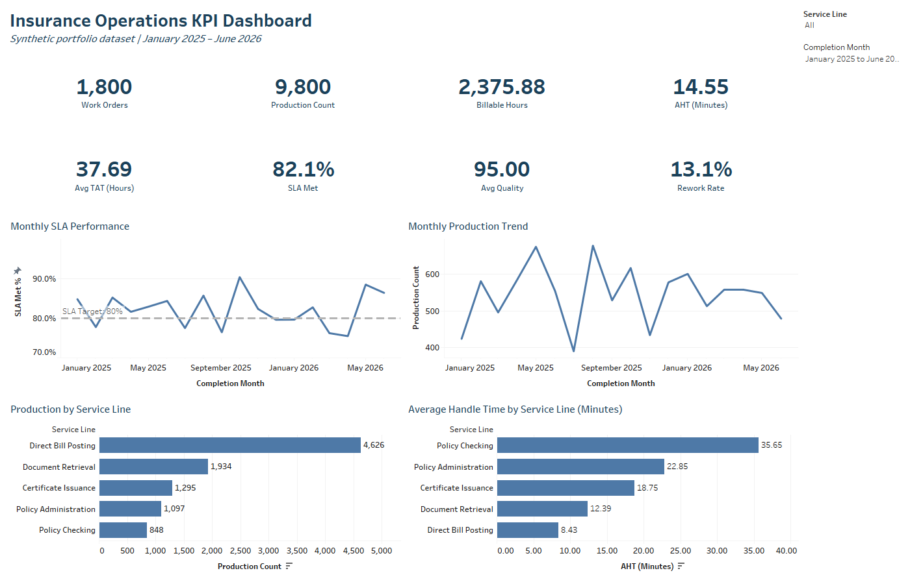

# Insurance Operations KPI Dashboard

An end-to-end analytics portfolio project that uses SQL Server and a Tableau-ready synthetic dataset to measure operational productivity, Average Handle Time (AHT), Turnaround Time (TAT), SLA performance, quality, and rework.

> All records are synthetic. No employer, client, employee, or production-system data is included.

## Interactive Tableau Dashboard



[Download the interactive Tableau packaged workbook](dashboard/Insurance_Operations_KPI_Dashboard.twbx)

## Business Objective

Operations leaders need a consistent way to answer five questions:

1. How much work and production were completed?
2. Which service lines require the most handling time?
3. Are work orders being completed within SLA targets?
4. How do productivity and turnaround time change over time?
5. Where are quality and rework risks concentrated?

This project converts those questions into documented KPI definitions, reusable SQL queries, a dashboard-ready dataset, and a visual analysis workbook.

## Project Results

The synthetic dataset contains 1,800 completed work orders from January 2025 through June 2026.

| KPI | Result |
|---|---:|
| Work Orders | 1,800 |
| Production Units | 9,800 |
| Billable Hours | 2,375.88 |
| Average Handle Time | 14.55 minutes |
| Average Turnaround Time | 37.69 hours |
| SLA Met | 82.1% |
| Average Quality Score | 95.0 |
| Rework Rate | 13.1% |

### Selected Insights

- **Policy Checking** had the highest AHT at **35.65 minutes per production unit**.
- **Direct Bill Posting** generated the most production at **4,626 units** and had the lowest AHT at **8.43 minutes**.
- **Policy Administration** had the highest average elapsed TAT at **51.54 hours**.
- Monthly SLA performance ranged from **75.5% to 90.4%**, showing meaningful process variability for investigation.
- These findings describe a synthetic scenario and demonstrate the analytical method; they are not claims about a real company.

## KPI Definitions

| KPI | Definition |
|---|---|
| Work Orders | Distinct completed work-order count |
| Production | Sum of completed transaction units |
| Billable Hours | Sum of billable operational effort |
| AHT (Minutes) | `Billable Hours / Production Count × 60` |
| TAT (Hours) | Elapsed hours between receipt and completion |
| SLA Met % | Work orders completed within their assigned SLA target divided by completed work orders |
| Rework Rate | Work orders marked for rework divided by completed work orders |

## Tools and Skills Demonstrated

- Microsoft SQL Server and SSMS
- Tableau Desktop dashboard design and interactive filtering
- Excel-based validation and KPI preview
- KPI definition and metric governance
- Data-quality testing
- Operational trend and service-line analysis
- Business insight documentation
- Git and GitHub project documentation

## Repository Structure

```text
insurance-operations-kpi-dashboard/
├── dashboard/
│   ├── Insurance_Operations_KPI_Dashboard.twbx
│   ├── tableau_kpi_dashboard.png
│   ├── excel_kpi_summary_preview.png
│   └── tableau_dashboard_build_guide.md
├── data/
│   ├── insurance_operations_analysis.xlsx
│   └── insurance_operations_synthetic.csv
├── docs/
│   ├── data_dictionary.md
│   └── methodology_and_assumptions.md
├── sql/
│   ├── 01_create_table.sql
│   ├── 02_load_data.sql
│   ├── 03_data_quality_checks.sql
│   ├── 04_kpi_analysis.sql
│   └── 05_dashboard_view.sql
├── .gitignore
├── LICENSE
└── README.md
```

## How to Run the Project

1. Download or clone the repository.
2. Open SQL Server Management Studio and select a practice database.
3. Run `sql/01_create_table.sql`.
4. Update the local CSV path in `sql/02_load_data.sql`, then run it.
5. Run `sql/03_data_quality_checks.sql` and confirm that no critical checks fail.
6. Run `sql/04_kpi_analysis.sql` to review the KPI outputs.
7. Run `sql/05_dashboard_view.sql` to create the Tableau-ready view.
8. Connect Tableau to the SQL view or directly to the CSV and follow the dashboard build guide.

The Excel workbook in `data/` provides a formula-driven validation model and visual KPI preview.

## Data Privacy

The dataset was generated specifically for this portfolio. Client IDs, employee IDs, dates, work volumes, performance values, and results have no connection to a real organization.

## Author

**Hardik Khodiyar**  
Data Analyst | SQL | Tableau | Power BI | Python  
[LinkedIn](https://www.linkedin.com/in/hardik-khodiyar-640449171) | [GitHub](https://github.com/Hardik2993)

